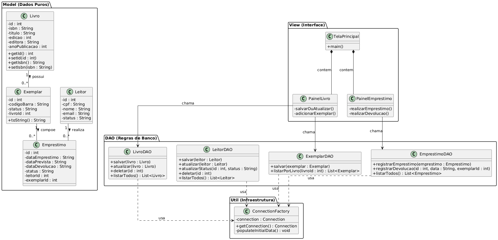
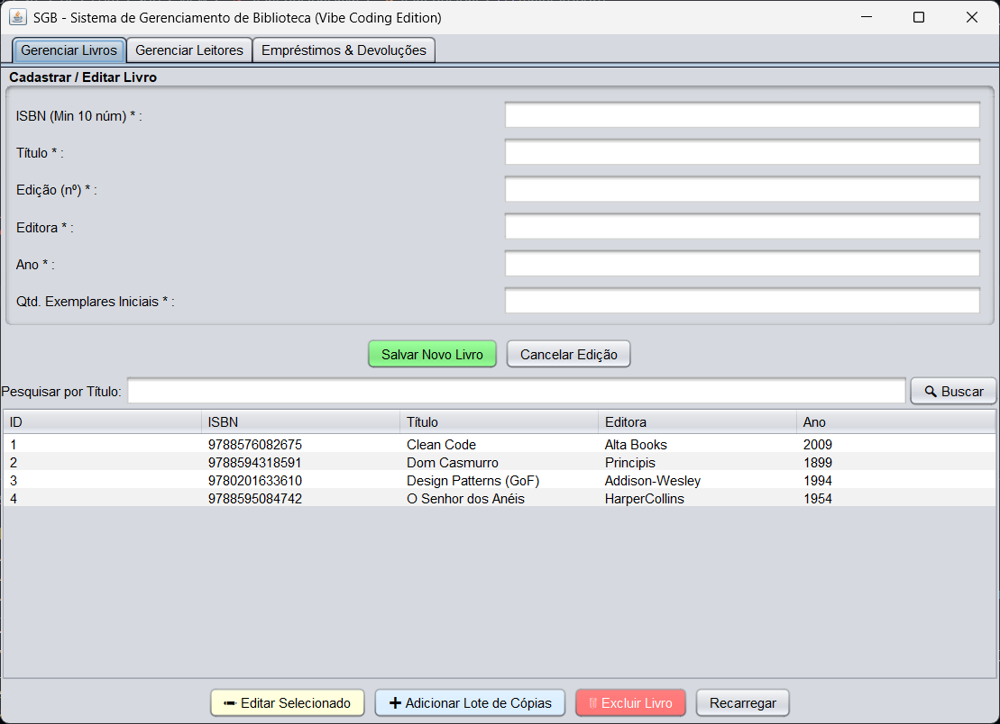
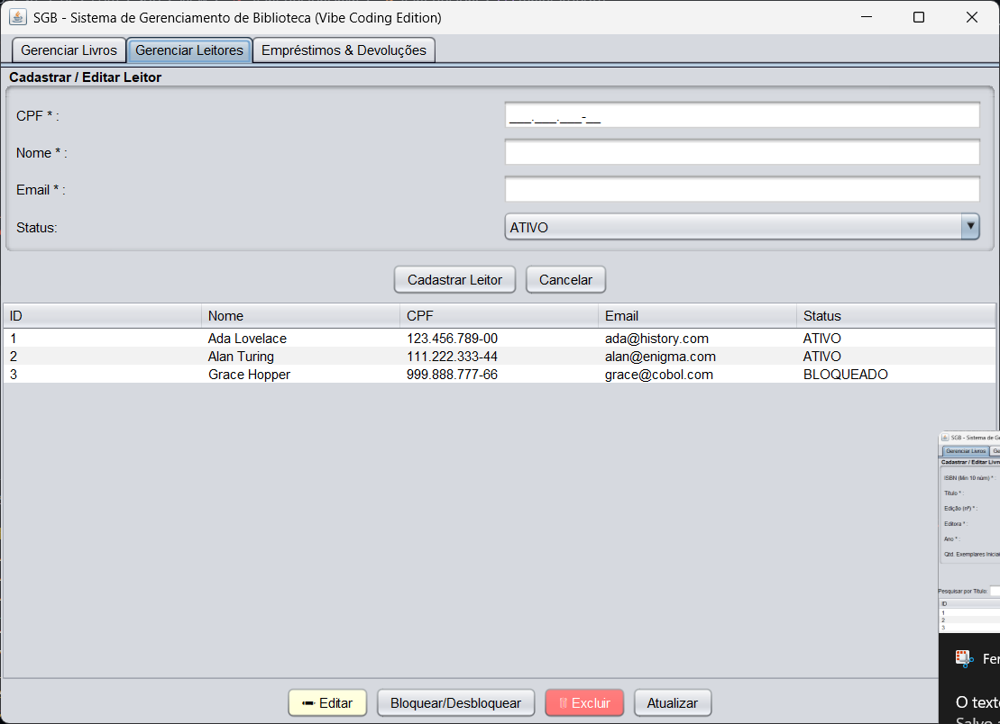
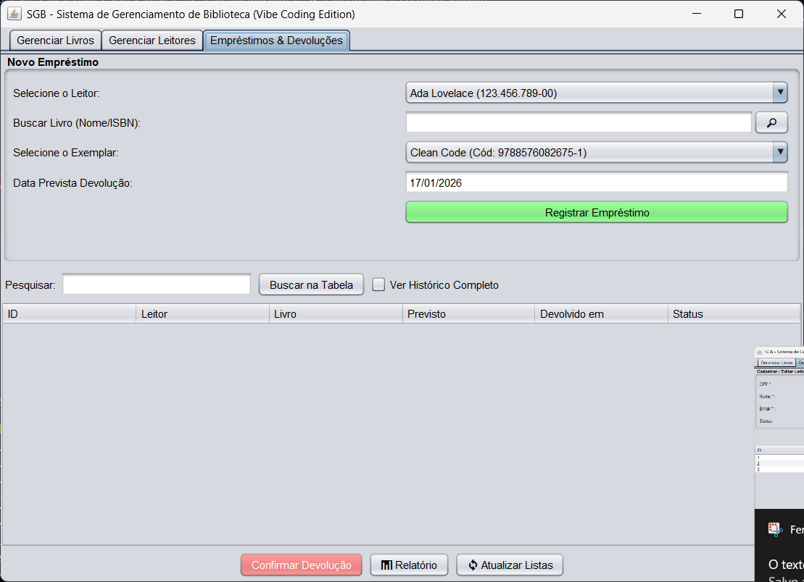

# 📚 Sistema de Gerenciamento de Biblioteca (SGB)

Projeto final desenvolvido para a disciplina de *Programação Orientada a Objetos* do curso de *Análise e Desenvolvimento de Sistemas (IFPI)*.

*Alunos:*  Adaildo Carvalho Mesquita, Francisco Emanuel Cunha Almeida

O software consiste em uma aplicação Desktop em Java para controle de acervo e empréstimos, utilizando banco de dados embarcado (SQLite) para garantir portabilidade e persistência dos dados.

---

## 🚀 Tecnologias e Decisões de Projeto

Baseado no código desenvolvido, o projeto utiliza:

* *Linguagem:* Java (JDK 25).
* *Banco de Dados:* *SQLite* (Arquivo biblioteca.db).
    * Motivo: Facilidade de execução sem necessidade de configuração de servidor externo.
* *Interface Gráfica:* Java Swing.
* *Arquitetura:* MVC com padrão *DAO* (Data Access Object).

---

## 🏛️ Estrutura do Código (Baseado na Implementação)

O projeto está organizado para respeitar os pilares da POO (Encapsulamento e Abstração):

### 1. Pacote model (Entidades)
Classes que representam as tabelas do banco, contendo apenas atributos privados e métodos Getters/Setters.
* Livro.java: Dados da obra.
* Exemplar.java: Contém o livroId e o status (Disponível/Emprestado).
* Leitor.java: Dados pessoais.
* Emprestimo.java: Registra as datas e faz a ligação entre Leitor e Exemplar.

### 2. Pacote dao (Persistência)
Responsável por executar o SQL no SQLite.
* O código utiliza PreparedStatement para evitar injeção de SQL.
* A classe ConnectionFactory conecta via JDBC URL: jdbc:sqlite:ProjetoFinalPOO/biblioteca.db.

### 3. Pacote view (Telas)
* Telas construídas com componentes Swing (JFrame, JPanel, JButton).
* A interação do usuário chama os métodos do DAO para salvar/buscar dados.

---

## 📐 Diagrama de Classes
A estrutura abaixo reflete a organização dos pacotes e relacionamentos do código Java.

---

## 🖥️ Capturas de Tela do Sistema

### Cadastro de Livros e Exemplares

### Cadastro de Leitores

### Realização de Empréstimo

---

## ⚙️ Como Executar o Projeto

Como o banco de dados é o *SQLite*, não é necessário instalar SGBD externo.

1.  Certifique-se de ter o Java (JDK) instalado.
2.  Tenha a biblioteca (JAR) do sqlite-jdbc no classpath do projeto.
3.  Compile e execute a classe principal: br.com.biblioteca.view.TelaPrincipal.